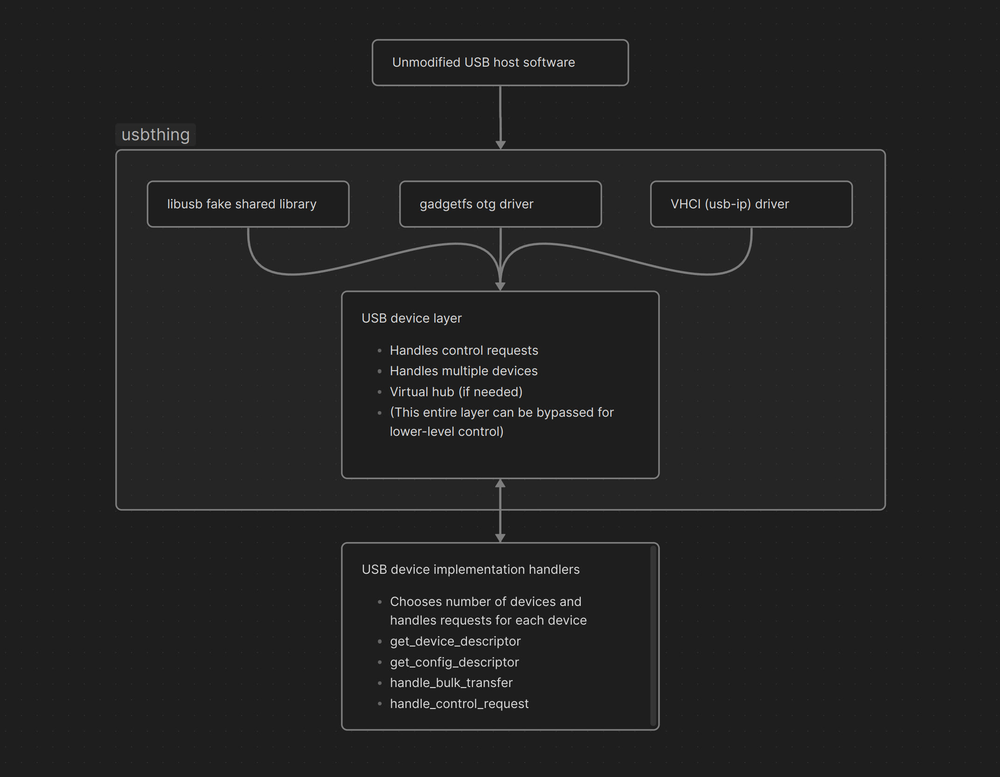

# usbthing

This is a general purpose layer for creating/emulating/spoofing USB devices. Devices such as:
- Flash drives
- [Cameras](https://github.com/petabyt/vcam)
- Game controllers
- HID devices
- Anything else that plugs into a USB port
Can be emulated with this library.



All control/bulk/interrupt requests for a device (the implementation) will be routed to a backend.
A backend will route the communication of a device to an interface where it can be useful.

### libusb-v1.0
A fake .so/.dll drop-in replacement for libusb-v1.0 - this is easy to manage and is great for CI testing.
### vhci
Creates a device on the kernel's virtual host interface - ideal for routing to VMs
### gadgetfs
The linux kernel interface over DWC - used to expose a device over a physical OTG port. If you run usbthing on a raspberry pi, you can
plug it into any computer to emulate USB devices. Maybe useful for pentesting.

## Usage
See usbthing.h for more info on how to use this. It's pretty short.
```
# Test VHCI backend:
gcc dummy.c vhci.c device.c usbstring.c && ./a.out
./a.out

# Test libusb backend
gcc -shared libusb.c dummy.c `pkg-config --libs --cflags libusb-1.0`
# Note: delete main() from dummy.c before compiling
```

## Roadmap
- [x] Handlers for all common control requests
- [x] VHCI
- [x] libusb-v1.0
- [ ] gadgetfs (currently WIP)
- [x] Bulk endpoints
- [ ] Handle interrupt endpoint polling
- [ ] Virtual hub (if possible)
- [ ] Stable API and ABI
